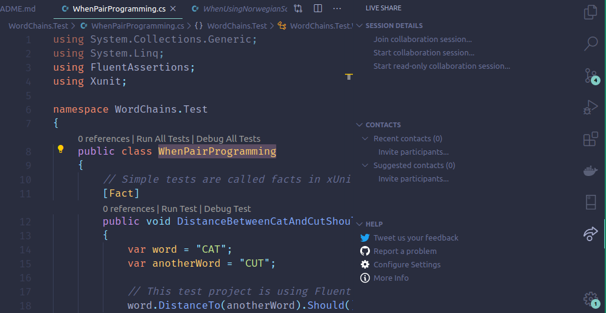

Online pair programming
=======================
_Workshop on online pair programming, using VS Code Live Share._


Installation Guide
------------------
_To partake in the workshop, you'll need to have the .NET Core 3.1 SDK, and VS Code with the C# and Live Share extensions._

### .NET Core 3.1 SDK
_If you already have .NET Core installed, you can check the version with `dotnet --version`._

You can get .NET Core from the [.NET Core SDK download page](https://www.microsoft.com/net/download). Just follow the instructions for your operating system, and you should be all set.

### VS Code with C# and Live Share extensions
C# can be edited in a number of different editors and IDE's, but since we'll be relying on VS Code Live share in this workshop, you'll have to use VS Code. You can grab a copy of VS Code from the [VS Code download page](https://code.visualstudio.com/).

To make it a little bit easier to work with C#, you also want to get the [C# extension for VS Code](https://marketplace.visualstudio.com/items?itemName=ms-dotnettools.csharp).

Finally you need to get the [Live Share extension for VS Code](https://marketplace.visualstudio.com/items?itemName=MS-vsliveshare.vsliveshare). In order to use Live Share, you'll also need a GitHub or Microsoft account. If you don't have either, it's quite easy to [create a new GitHub account](https://github.com/join).


The Word Chains Puzzle
----------------------
_The Word Chains Puzzle is adapted from [codekata.com](http://codekata.com/kata/kata19-word-chains/)._

There’s a type of puzzle where the challenge is to build a chain of words, starting with one particular word and ending with another. Successive entries in the chain must all be real words present in a dictionary, and each can differ from the previous word by just one letter. For example, you can get from "CAT" to "DOG" using the following chain:

```
CAT -> COT -> COG -> DOG
```

You can get from "LEAD" to "GOLD" in four steps:

```
LEAD -> LOAD -> GOAD -> GOLD
```

In addition you can get from "RUBY" to "CODE" in six steps:

```
RUBY -> RUBS -> ROBS -> RODS -> RODE -> CODE
```

The objective of this puzzle is to write a function that finds a word chain between two words, using words from a dictionary.

### Where should we start?
It's a good idea to start by writing a function that finds the distance between two words. I.e. the distance between "ABBA" and "ALBA" is 1, since we have to change one letter to turn "ABBA" into "ALBA".

[FindWordChains.cs](WordChains/FindWordChains.cs) declares the function `int DistanceTo(this string word, string anotherWord)`, that can be used as a starting point. A unfinished set of tests for this function is supplied in [WhenPairProgramming.cs](WordChains.Test/WhenPairProgramming.cs).

### Where should we end up?
You might need more supporting functions than just `DistanceTo(...)`, but in the end you should be able to implement `IEnumerable<string> FindWordChain(this IEnumerable<string> dictionary, string fromWord, string toWord, int withDistance = 1)` in [FindWordChains.cs](WordChains/FindWordChains.cs). When you think you got the implementation working, you ca try to run the verification tests in [WhenUsingNorwegianScrabbleFederationDictionary.cs](WordChains.Test/WhenUsingNorwegianScrabbleFederationDictionary.cs). Just remove the "skip" options as described in the tests.

It's totally fine to just skip handling the optional `withDistance` parameter until you have a working solution for `withDistance = 1`.

### What should we do if we have additional time?
For added programming fun, try to return the shortest word chain that solves each puzzle. You can also have a look at optimizing your code, so you can find word chains faster.


Testing and running WordChains
------------------------------
Testing and running WordChains can be performed from the [integrated terminal](https://code.visualstudio.com/docs/editor/integrated-terminal) in VS Code. To open it, start by opening the [command palette](https://code.visualstudio.com/docs/getstarted/tips-and-tricks#_command-palette) by pressing `Ctrl+Shift+P`. Search for "integrated terminal" and select "View: Toggle Integrated Terminal".


### Testing
From the integrated terminal, navigate to the folder `/WordChains.Test`, and run `dotnet test`. This will run all tests in the test-project once.

```shell
$ WordChain.Test> dotnet test

...

Test Run Successful.
Total tests: 6
     Passed: 3
    Skipped: 3
 Total time: 1.2184 Seconds
```

If you wish to re-run tests whenever a file is saved, you can use `dotnet watch test`.

```shell
$ WordChain.Test> dotnet watch test
watch : Started

...

Test Run Successful.
Total tests: 7
     Passed: 3
    Skipped: 4
 Total time: 1.2476 Seconds
watch : Exited
watch : Waiting for a file to change before restarting dotnet...
```

Press `Ctrl+C` if you want to stop watching files and running tests.

### Running the console application
The WordChains application, is a console application that can be executed from the integrated terminal. Navigate to the `/WordChains` folder, and run `dotnet run`. This will launch the application, and display information about the different options and parameters used.

```shell
$ WordChain> dotnet run
WordChains 1.0.0
Copyright (C) 2020 WordChains

ERROR(S):
  A required value not bound to option name is missing.

  -f, --from                  (Default: ABER) The word you want to start the word chain with.

  -t, --to                    (Default: ABBA) The word you want to end the word chain with.

  -d, --distance              (Default: 1) The distance, i.e. the number of letters that differ, between
                              each word in the word chain.

  --help                      Display this help screen.

  --version                   Display version information.

  dictionary file (pos. 0)    Required. A dictionary file, containing a collection of words, with one
                              single word on every line.
```

The WordChains applications requires a dictionary file, and a _from_ and _to_ word to find a chain between. To supply these arguments, we need to add `--` after the `dotnet run` command. Then we can supply a path to the dictionary file, and the `-f` and `-t` options.

```shell
$ WordChain> dotnet run -- ../norwegian-scrabble-federation-dictionary.txt -f abba -t aber
Found word chain from ABBA to ABER!
  Chain length: 33
  Word chain: ABBA -> ALBA -> ALFA -> ALKA -> AKKA -> AKKE -> AKME -> AKNE -> AGNE -> AGNA -> AGGA -> ANGA -> ANDA -> ANDE -> ANGE -> ALGE -> ALGI -> ANGI -> ANGL -> ANAL -> APAL -> ASAL -> ATAL -> AVAL -> AVAR -> AFAR -> AGAR -> AGAM -> AGAT -> AGET -> AGEN -> AGER -> ABER
```

_NB: When starting out, you wont be able to find any word chains using the console application. This is because we haven't implemented any code for finding word chains yet._


Tips on collaborating online
----------------------------

### Starting a Live Share session


1. Press the Live Share icon to the left or right in VS Code.
2. Choose "Start collaboration session".
3. Send the link to the collaboration session to your programming partner.

### How to create a Hangouts Meet


1. Go to [meet.google.com](https://meet.google.com/).
2. Choose "Join or start a meeting". _If you don't see this option, make sure you're logged on with your Computas GSuite user (i.e. foo@computas.com)_
3. Follow the instructions given. When the meeting is ready, copy the address from the address bar, and share it whit your programming partner.


Some C# Tips
------------
_Below is some sample code, illustrating a bit of Linq, and how you migth turn a string into an array of letters. Have a loot at the [C# Programming Guide](https://docs.microsoft.com/en-us/dotnet/csharp/programming-guide/) for more tips._

```csharp
using System;
using System.Linq;
					
public class Program
{
	public static void Main()
	{
		var numbers = new int[] { 1, 2, 3, 4, 5, 6 };

		var newNumbers = numbers;
		// var newNumbers = numbers.Where(n => n > 3);
		// var newNumbers = numbers.Select(n => n + 2);
		
		// var otherNumbers = new int[] { 1, 2, 3 };
		// var newNumbers = numbers.Zip(otherNumbers, (n, m) => n + m);

		Console.WriteLine($"The new numbers are: {string.Join(", ", newNumbers)}");
		
		// var letters = "Hei igjen alle sammen".ToCharArray();
		// Console.WriteLine($"The letters are: {string.Join(", ", letters)}");
	}
}
```

